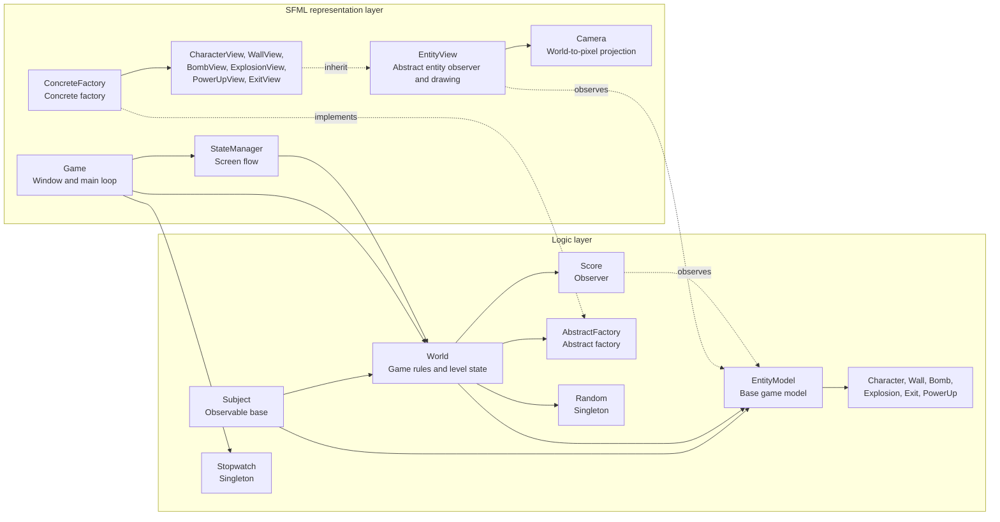
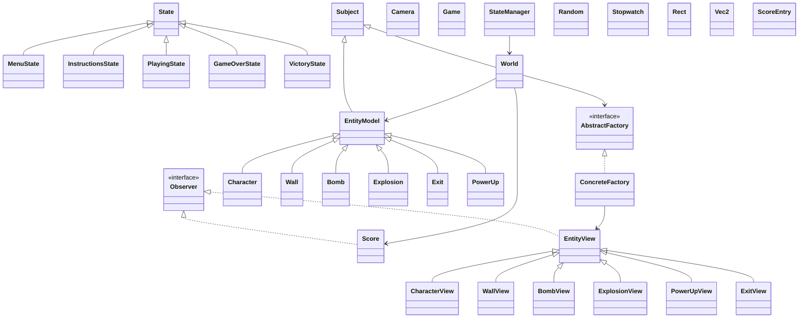
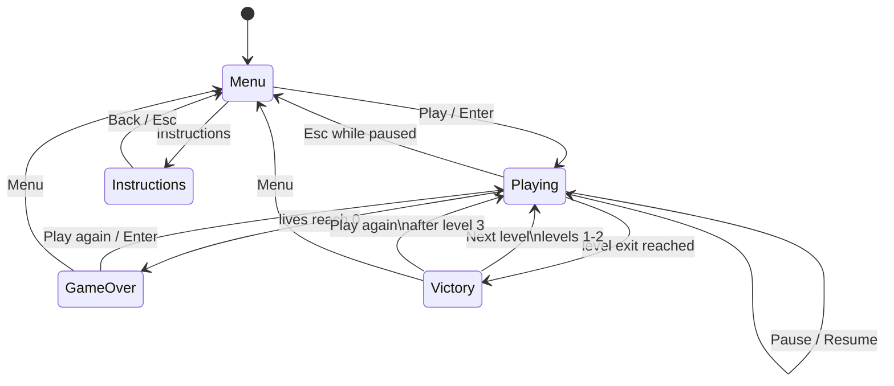
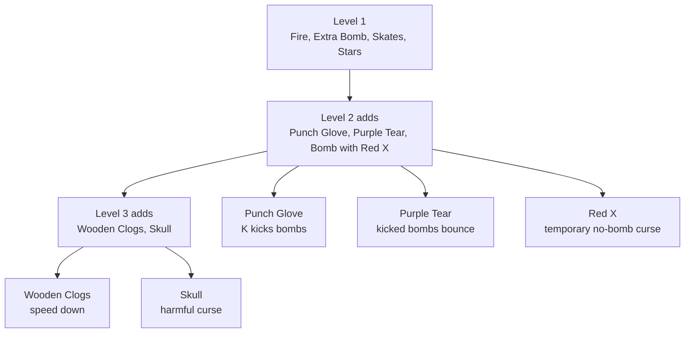

# Bomberman AP

Advanced Programming project. It is a small Bomberman style game made in C++20 with SFML.

## Student

- Name: TODO
- Student number: TODO
- 

## Build and Run

The project uses CMake. The logic part is a library, and the SFML game uses that library.

The CI file is in `.circleci/config.yml`. It builds the project on Ubuntu 20.04.

## Game

The game starts with a menu. The menu shows the top five scores and has a Play button. There is also an instructions screen with controls and power-ups.

The player starts in the top left corner. The three enemies start in the other corners. The goal is to kill all enemies. After all enemies are dead, an exit appears. The player can go to the exit or first take more power-ups.

Controls:

- Move: arrow keys or WASD
- Place bomb: Space
- Kick bomb after collecting Punch Glove: K
- Pause/resume: Enter
- Return to menu while paused: Esc

## Gameplay Features

Bombs explode after a short timer. The explosion is a cross shape. Hard walls stop the explosion. Soft walls break, but only one soft wall can break in each direction. If another bomb is hit, it also explodes. Power-ups that are already visible also burn.

These rules were chosen because they match the classic Bomberman loop: the player has to clear space, trap enemies, and avoid getting trapped by their own bombs. The bomb rules are kept in the logic layer so the same behaviour is used by the player, enemies, score system, and tests.

Soft blocks can drop a power-up when they break. These are the required power-ups:

- Fire: increases bomb range
- Extra Bomb: increases bomb capacity
- Skates: increases movement speed

I also added extra items:

- Stars: bonus score
- Punch Glove: lets the player kick bombs
- Purple Tear: kicked bombs bounce back when blocked
- Red X: temporarily disables bomb placement
- Wooden Clogs: slows movement
- Skull: harmful item

There are three levels. Every level adds more possible items:

- Level 1: Fire, Extra Bomb, Skates, Stars
- Level 2: adds Punch Glove, Purple Tear, Red X
- Level 3: adds Wooden Clogs and Skull

I introduced the extra items gradually instead of enabling everything from level 1. This makes the first level easy to understand, then adds more risk and movement options later. The negative items also make power-up collection less automatic, because the player must pay attention to what was revealed.

The player has lives. When the player loses a life, the upgrades reset and the player goes back to the start. When the last life is gone, the game is over and the score is saved. This is an extra thing I added because Bomberman normally has lives.

## Mandatory Features and Extras

The mandatory gameplay features are:

- grid based arena with indestructible walls and destructible blocks
- player movement and collision
- bomb placement, timed explosions, and chain reactions
- enemies that can move around the arena
- the required power-ups: Fire, Extra Bomb, and Skates
- multiple levels
- score keeping and high score saving

The extras I added are:

- five player lives
- exit that appears after all enemies are defeated
- Punch Glove bomb kicking
- Purple Tear bouncing kicked bombs
- harmful power-downs: Red X, Wooden Clogs, and Skull

## Scoring

The score is handled by the `Score` class. It listens to game events and saves the top five scores in `scores.txt`.

The score includes:

- time alive
- destructible blocks destroyed by the player's bombs
- power-ups collected by the player
- enemies killed by the player
- win bonus
- loss penalty

## Architecture

The project is split in two main parts:

- `src/logic`: game rules, entities, collisions, bombs, power-ups, AI, score, random, and stopwatch
- `src/sfml`: window, drawing, input, states, camera, and sprites

`World` became big, so I split its code in multiple `.cpp` files:

- `World.cpp`: general game flow, arena, movement, exit, cleanup
- `WorldAi.cpp`: enemy decisions and escape checks
- `WorldBombs.cpp`: bombs, explosions, kicking, chain reactions
- `WorldPowerUps.cpp`: power-up spawning and effects

I kept one `World` class because the systems share the same arena state, entity list, bombs, explosions, power-ups, and player state. Splitting the implementation into separate files made the code more readable without exposing more public classes than necessary.

## Important Classes

The main classes are `Subject`, `World`, `EntityModel`, `Character`, `Wall`, `Bomb`, `Explosion`, `Exit`, `PowerUp`, `Score`, `AbstractFactory`, `ConcreteFactory`, `EntityView`, `CharacterView`, `WallView`, `BombView`, `ExplosionView`, `PowerUpView`, `ExitView`, `StateManager`, `Camera`, `Random`, and `Stopwatch`.

## Design Patterns

The project uses the following design patterns:

- MVC: the logic layer has the game state and rules, and SFML handles input and drawing
- Observer: entities send events to `EntityView` objects and `Score`
- Abstract Factory: `World` creates entities using `AbstractFactory`, and `ConcreteFactory` adds the views
- Singleton: `Random` and `Stopwatch` are singletons

I also used a simple State pattern for menu, instructions, playing, game over, and victory.

The main reason for MVC was separation of responsibility. `World` should be able to run the game even without a window, while `Game`, `StateManager`, and the `EntityView` classes should only care about input, screens, and rendering. This also made the logic tests possible.

The Observer pattern was useful because different parts of the program need to react to the same entity changes. When an entity moves or dies, the matching `EntityView` can update the visual representation and `Score` can react to score events without the entity needing to know about either system.

The Abstract Factory was used because `World` needs to create characters, blocks, bombs, explosions, exits, and power-ups, but it should not know how SFML sprites are created. In the real game, `ConcreteFactory` creates the logic entity and attaches its view. In the tests, a small test factory creates only logic entities.

`Random` and `Stopwatch` were made singletons because random generation and time are shared services. This avoids passing them through every method that needs them. I kept the actual game state out of singletons, because the state belongs to `World`.

The State pattern was used for the screen flow because each screen has different input and rendering rules. A menu, instructions screen, paused game, game over screen, and victory screen should not all be controlled by one large conditional in the main loop.

## Game Flow

## Power-Up Progression

## Enemy AI

Enemies have simple AI. They try to:

- escape bomb and explosion danger
- move toward nearby power-ups
- place bombs next to destructible blocks
- place bombs when the player is in blast range
- walk around when there is no clear target

When an enemy places a bomb, it remembers that and tries to run away.

I chose a simple rule based AI instead of a complex pathfinding system for every decision. The arena is small and Bomberman movement is tile based, so local decisions are enough for enemies to feel active. The AI checks dangerous tiles, avoids harmful power-ups, follows the player within a limited range, and uses a small breadth-first search when it needs an escape route from a bomb.

The hardest part of the AI was making enemies place bombs without immediately killing themselves. It was not enough to check if a bomb would be useful; the enemy also had to know that a safe escape path existed before placing it. Another difficult part was danger detection, because explosions are blocked by walls and destructible blocks, and chain reactions can change the situation quickly.

## Tests

The logic tests are in `tests/logic_tests.cpp`. They check:

- movement and bomb reuse
- power-up persistence between levels
- power-up reset after losing a life
- level cap
- bomb kick and bouncing bombs
- exit creation after enemies are defeated
- explosions destroying visible power-ups
- survival time score with small frame times

The tests use a small test factory, so they can run without SFML.

## Reflection

The easiest parts to implement were the basic entities, movement, and drawing once the logic and SFML layers were separated. The entity model is small, and using world coordinates plus tile conversion made collision and rendering predictable.

The scoring system was also easier than the AI and bomb logic. Most score changes happen when something important happens in the game, such as destroying a block, collecting a power-up, killing an enemy, winning, or losing. Because of that, the score code could stay mostly inside the `Score` class instead of being spread through the whole project.

The more difficult parts were bombs, explosions, and AI. Bombs interact with many systems at once: collision, ownership, available bomb count, soft block destruction, power-up burning, chain reactions, enemy damage, player damage, and kicked movement. Small mistakes there could create bugs that only appeared after several timed updates.

The AI was the most challenging extra feature. It needed to look believable, avoid obvious danger, collect useful items, place bombs for a reason, and escape after placing a bomb. The final version is still intentionally simple, but it is more robust because enemies check for safe escape paths before bombing and recalculate movement when their target becomes unsafe.
