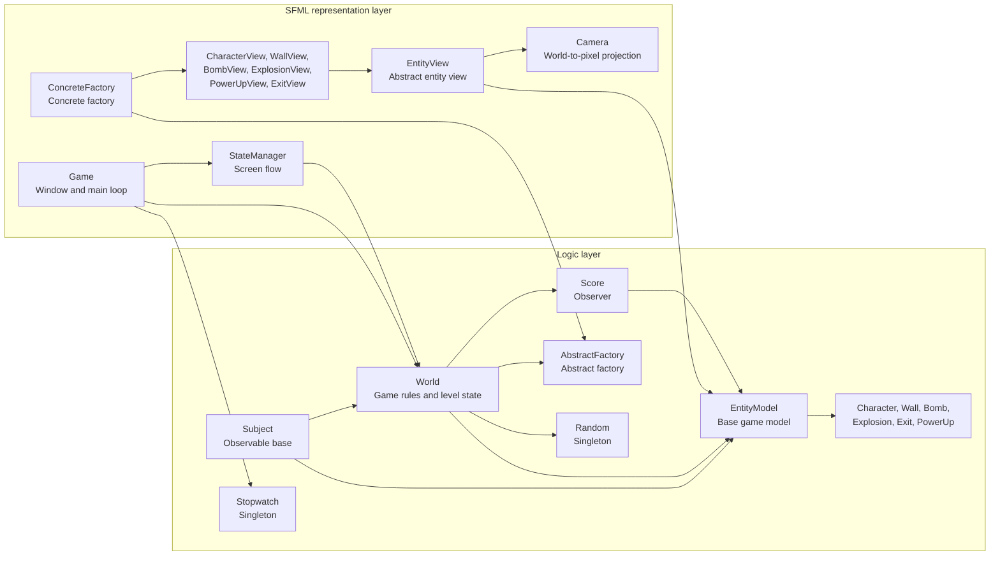
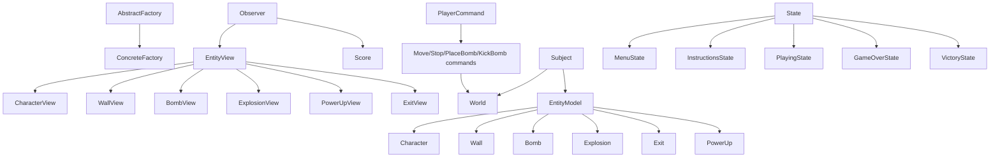
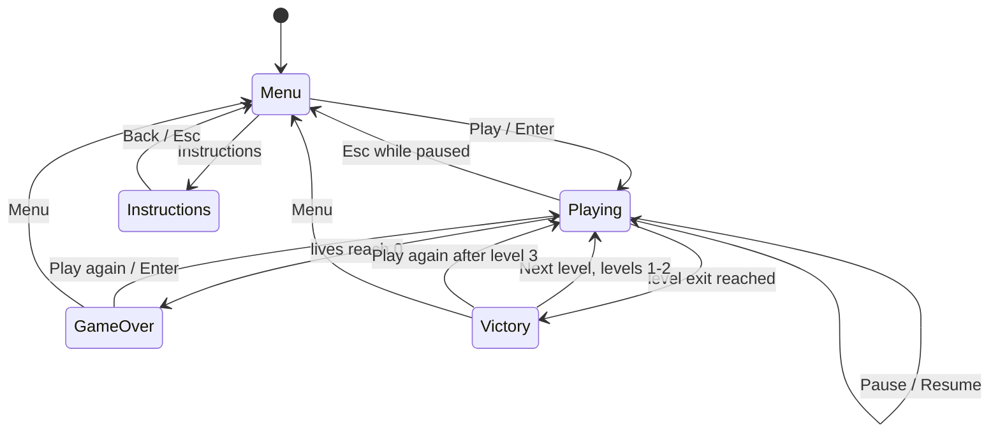
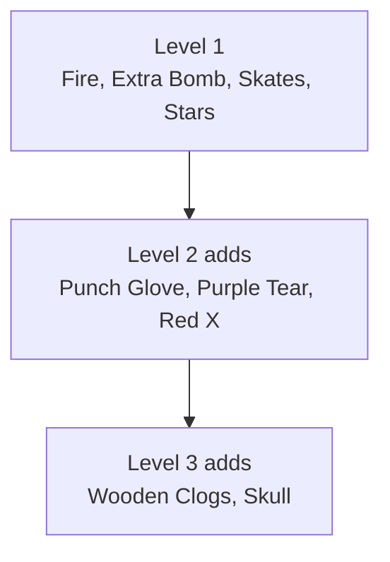

# Bomberman AP Report

- Name: TODO
- Student number: TODO
- GitHub repository: TODO

## 1. Introduction

This is a small Bomberman style game. It is written in C++20 and uses SFML for graphics. This report explains the gameplay choices, architecture, class hierarchy, design patterns, tests, and reflection on the implementation.

## 2. Gameplay

The game starts with a menu that shows the top five scores and a Play button. There is also an instructions screen with the controls and power-ups.

The player starts in the top left corner. The three enemies start in the other corners. The goal is to defeat all enemies. After all enemies are dead, an exit appears. The player can enter the exit immediately, or collect more power-ups first.

### Bombs and Explosions

Bombs use the classic Bomberman rules: after a short timer they explode in a cross shape, walls block the blast, destructible walls break, nearby bombs can trigger chain reactions, and visible power-ups can burn. These rules live in the logic layer so the player, enemies, score system, and tests all use the same behaviour.

### Power-Ups and Extras

The required Fire, Extra Bomb, and Skates power-ups are implemented. I also added Stars, Punch Glove, Purple Tear, Red X, Wooden Clogs, and Skull.

The extra items are introduced gradually across three levels. This keeps the first level simple and makes later levels more risky. Harmful items also make collecting power-ups less automatic, because the player has to pay attention to what appears.

### Lives

The player has five lives. When the player loses a life, upgrades reset and the player returns to the start position. When all lives are gone, the game is over and the score is saved. I added this because lives are a normal part of classic Bomberman.

## 3. Required Features and Extras

The required gameplay systems are implemented.

The main extras I added are:

- five player lives
- an exit that appears after all enemies are defeated
- Punch Glove bomb kicking
- Purple Tear bouncing kicked bombs
- harmful power-downs: Red X, Wooden Clogs, and Skull

## 4. Scoring

The `Score` class handles the score. It listens to game events and saves the top five scores in `scores.txt`. 

The project has two main parts:

- `src/logic`: game rules, entities, collisions, bombs, power-ups, AI, score, random, and stopwatch
- `src/sfml`: window, drawing, input, screens, camera, concrete factory, and entity views

`World` became large, so I split its implementation into multiple `.cpp` files:

- `World.cpp`: general game flow, arena, movement, exit, cleanup
- `WorldAi.cpp`: enemy decisions and escape checks
- `WorldBombs.cpp`: bombs, explosions, kicking, chain reactions
- `WorldPowerUps.cpp`: power-up spawning and effects

I kept one `World` class because these systems share the same arena state, entity list, bombs, explosions, power-ups, and player state. Splitting only the implementation files keeps the code readable without adding public classes that are not really needed.

## 6. Important Classes

The main classes are `Subject`, `World`, `PlayerCommand`, `MoveLeftCommand`, `MoveRightCommand`, `MoveUpCommand`, `MoveDownCommand`, `StopHorizontalCommand`, `StopVerticalCommand`, `PlaceBombCommand`, `KickBombCommand`, `EntityModel`, `Character`, `Wall`, `Bomb`, `Explosion`, `Exit`, `PowerUp`, `Score`, `AbstractFactory`, `ConcreteFactory`, `EntityView`, `CharacterView`, `WallView`, `BombView`, `ExplosionView`, `PowerUpView`, `ExitView`, `StateManager`, `State`, `Camera`, `Random`, and `Stopwatch`.

The five concrete states are implemented in `src/sfml/StateManager.cpp` under the `bomberman::sfml::state` namespace. They do not need to be public headers because only `StateManager` creates and uses them.

## 7. Design Patterns

The project uses these design patterns:

- MVC: the logic layer holds the game state and rules, while the SFML layer handles input, screens, and drawing.
- Observer: `EntityModel` objects notify `EntityView` objects and `Score`.
- Abstract Factory: `World` creates entities through `AbstractFactory`; `ConcreteFactory` creates the logic model and attaches the matching view.
- Singleton: `Random` and `Stopwatch` are singletons.
- State: menu, instructions, playing, game over, and victory are separate state classes managed by `StateManager`.
- Command: SFML input is translated into `PlayerCommand` objects such as `MoveLeftCommand`, `PlaceBombCommand`, and `KickBombCommand`, which execute the matching action on `World`.

MVC was used to keep game rules separate from graphics. `World` can run without an SFML window, which makes logic tests possible.

Observer was useful because score and graphics both need to react to model changes, but the model should not know about the concrete systems observing it.

The abstract factory keeps SFML out of the logic layer. In the real game, `ConcreteFactory` creates an entity and attaches the correct view. In tests, a small test factory creates only logic objects.

`Random` and `Stopwatch` are shared services, so singletons avoid passing them through many unrelated methods. The actual game state is not stored in singletons; it belongs to `World`.

The State pattern keeps screen-specific input and rendering separate. This avoids one large conditional in the main game loop.

The Command pattern keeps player input requests explicit and reusable. The playing state decides which command belongs to a key press, while the command object performs the matching world action. This keeps the input mapping separate from the implementation of movement, bomb placement, and bomb kicking.

## 8. Game Flow

## 9. Power-Up Progression

## 10. Enemy AI

Enemies use a simple rule based AI. They try to escape bomb and explosion danger, move toward nearby useful power-ups, place bombs next to destructible walls, place bombs when the player is in blast range, and walk around when there is no clear target.

I chose a simple rule based AI instead of full pathfinding for every decision. The arena is small and Bomberman movement is tile based, so local decisions are enough to make enemies feel active. The AI checks dangerous tiles, avoids harmful power-ups, follows the player within a limited range, and uses a small breadth-first search when it needs an escape route from a bomb.

The hardest part of the AI was making enemies place bombs without killing themselves immediately. It was not enough to check if a bomb would be useful; the enemy also had to know that a safe escape path existed before placing it. Danger detection was also difficult because explosions are blocked by walls and destructible blocks, and chain reactions can change the situation quickly.

## 11. Tests

The logic tests are in `tests/logic_tests.cpp`. They use a small test factory, so they can run without SFML. They check movement, bomb reuse, power-up persistence, life-loss reset, level cap, bomb kicking, bouncing bombs, exit creation, visible power-up destruction, and survival-time scoring.

## 12. Reflection

The easiest parts to build were the basic entities, movement, and drawing once the logic and SFML layers were separated. The entity model is small, and using world coordinates plus tile conversion made collision and rendering predictable.

The harder parts were bombs, explosions, and AI. Bombs interact with collision, ownership, available bomb count, soft block destruction, power-up burning, chain reactions, enemy damage, player damage, and kicked movement. Small mistakes there could create bugs that only appeared after several timed updates.

The AI was the most challenging extra feature. It needed to look believable, avoid obvious danger, collect useful items, place bombs for a reason, and escape after placing a bomb. The final version is still intentionally simple, but it is more reliable because enemies check for a safe escape path before placing a bomb and recalculate movement when their target becomes unsafe.
